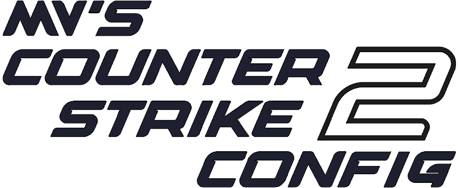

[![Contributors][contributors-shield]][contributors-url]
[![Forks][forks-shield]][forks-url]
[![Stargazers][stars-shield]][stars-url]
[![Issues][issues-shield]][issues-url]
[![MIT License][license-shield]][license-url]

<!-- PROJECT LOGO -->
 

  

  <h1 align="center">MVukanichh's CS2 Config</h1>
  

  MVukanichh's CS2 Config is a custom config template. It is well-documented and separated into individual config files in order to improve readability. It optimizes certain parts of CS2, but it's main purpose is to serve as an excellent template for personal customization of CS2 settings.
     
    <a href="../.github/CHANGELOG">View Changelog</a>
    ·
    <a href="../LICENSE">View License</a>
    ·
    <a href="https://github.com/MVukanichh/MVsCS2Config/issues">Report Bug</a>
    ·
    <a href="https://github.com/MVukanichh/MVsCS2Config/issues">Request Feature</a>
  

<!-- PROJECT LOGO -->

---

<!-- TABLE OF CONTENTS -->

  
Table of Contents

  <ol>
    <li>
      <a href="#about-the-project">About The Project</a>
    </li>
    <li>
      <a href="#getting-started">Getting Started</a>
      <ul>
        <li><a href="#prerequisites">Prerequisites</a></li>
        <li><a href="#installation">Installation</a></li>
      </ul>
    </li>
    <li><a href="#usage">Usage</a></li>
    <li><a href="#roadmap">Roadmap</a></li>
    <li><a href="#contributing">Contributing</a></li>
    <li><a href="#license">License</a></li>
    <li><a href="#acknowledgments">Acknowledgments</a></li>
  </ol>

---

<!-- ABOUT THE PROJECT -->
## About The Project

MVukanichh's Counter-Strike 2 Config is a config template. It's main purpose is to serve as an template for personal customization as it is well-documented and easy to read and edit, since it's organized into multiple config files, categorizing configs into separate files.

> [!NOTE]  
> While it's both intended to and recommended to edit configs provided in this template, it is also possible to use them as-is, since MVukanichh's CS2 Config(s) strive to have out-of-box optimized and (hopefully) best configured settings.

---

<!-- GETTING STARTED -->
## Getting Started

As stated previously, MVukanichh's CS2 Config can be used as-is, but it is highly recommended to edit to suit user's preferences.

### Prerequisites

In order for MVukanichh's CS2 Config to be usable, next software should be installed beforehand:

- Counter-Strike 2
- Notepad++
	- Notepad++ is used to edit Configs to match users' preferences. It is recommended to use Notepad++ instead of Windows Notepad, as it has better formatting and better readability.

### Installation

MVukanichh's CS2 Config includes optimized config templates, as stated before, but also closed-caption file used as a replacement for text mod and optimized launch options, thus two separate installation processes must be followed:

> [!NOTE]  
> As of 14th of December 2023, Text Mods have been disabled in Counter-Strike 2. In order to work around that, closed-caption file must be created and used instead.

#### Downloading the ZIP File 

In order to use files provided, zipped file containing whole repository, alongside files that will actually be used, must be downloaded. In order to do so, follow these steps:

1. Press green "Code" button found at the top of this repository
2. Press "Download ZIP"
3. Press "Save File" and choose in which Location ZIP File should be saved to

#### Launch Options

In order to apply Launch Options, next steps must be followed:

1. Right click on "Counter-Strike 2" in the Steam Library
2. Press "Properties" and a new window will pop-up
3. In the very first tab in the new window, "Set Launch Options" should be clicked on
4. Open ZIP File
5. Open Folder named "content"
4. Copy everything from "Launch Options" text file and click "Set Launch Options" button
5. Paste everything and press OK

#### Configs and Close-Captions file

In order to use Configs and Close-Captions files, next steps must be followed:

1. Right click on "Counter-strike 2" in the Steam Library
2. Press "Properties" and a new window will pop-up
3. Click on a "Local Files" tab
4. Press "Browse Local Files"
	- Windows Explorer window will pop-up with main folder within "Counter-Strike Global Offensive" game folder

> [!NOTE]  
> Even though the game is now "Counter-Strike 2", it still uses "Counter-Strike Global Offensive" name for the main folder. 

5. Open folder named "game"
6. Open folder named "csgo"
7. Open ZIP file 
8. Open Folder named "content"
9. Hold down Control button (CTRL) and select folders named "cfg" and "resource" within opened ZIP File and drag them to "csgo" folder
10. Press YES to everything if prompted

---

<!-- USAGE -->
## Usage

As stated previously, MVukanichh's CS2 Config can be used as-is, and if that's your choice, then in order to use it you have to do nothing more.

If, however, you want to edit configs to suit your preferences, do the following:

1. Right-click on "Counter-strike 2" in the Steam Library
2. Press "Properties" and a new window will pop-up
3. Click on a "Local Files" tab
4. Press "Browse Local Files"
5. Open folder named "game"
6. Open folder named "csgo"
7. Open folder named "cfg"
8. Open folder named "MVs"
9. Right-click on config file that you wan't to edit
10. Click on "Edit with Notepad++"

---

<!-- ToDO -->
## ToDo

- [ ] Add Closed-Caption files in languages other than English
	- [ ] Russian
	- [ ] Polish
	- [ ] German
- [ ] Add a section focusing on improving Performance for CS2

See the [open issues](https://github.com/MVukanichh/MVsCS2Config/issues) for a full list of proposed features (and known issues).

---

<!-- CONTRIBUTING -->
## Contributing

Contributions are what make the open source community such an amazing place to learn, inspire, and create. Any contributions made are **greatly appreciated**.

If there is any suggestion that would make this project better, open an issue with the tag "enhancement".

Don't forget to give the project a star! 

---

<!-- LICENSE -->
## License

Distributed under the CC-BY-4.0 License. See ``LICENSE`` for more information.

---

<!-- ACKNOWLEDGMENTS -->
## Acknowledgments

While writing this file, I've found these resources helpful and used them to make both this README.md file and other content in this project. Go check them out!

* [Choose an Open Source License](https://choosealicense.com)
* [README Templates for helping me chose README.md](https://www.readme-templates.com/)
* [Valve Software for list of CSGO Cvars](https://developer.valvesoftware.com/wiki/List_of_CS:GO_Cvars)
* [ArmynC's CSGO Config for a Config Template](https://github.com/ArmynC/ArminC-AutoExec)
* [xPaw for Custom Text Mod](https://github.com/xPaw/CS2)
* [Github Docs for help with Markdown](https://docs.github.com/en/get-started/writing-on-github)

(<a href="#about-the-project">back to top</a>)

---

[contributors-shield]: https://img.shields.io/github/contributors/MVukanichh/MVsCS2Config.svg?style=for-the-badge
[contributors-url]: https://github.com/MVukanichh/MVsCS2Config/graphs/contributors
[forks-shield]: https://img.shields.io/github/forks/MVukanichh/MVsCS2Config.svg?style=for-the-badge
[forks-url]: https://github.com/MVukanichh/MVsCS2Config/network/members
[stars-shield]: https://img.shields.io/github/stars/MVukanichh/MVsCS2Config.svg?style=for-the-badge
[stars-url]: https://github.com/MVukanichh/MVsCS2Config/stargazers
[issues-shield]: https://img.shields.io/github/issues/MVukanichh/MVsCS2Config.svg?style=for-the-badge
[issues-url]: https://github.com/MVukanichh/MVsCS2Config/issues
[license-shield]: https://img.shields.io/github/license/MVukanichh/MVsCS2Config.svg?style=for-the-badge
[license-url]: https://github.com/MVukanichh/MVsCS2Config/blob/master/LICENSE.txt