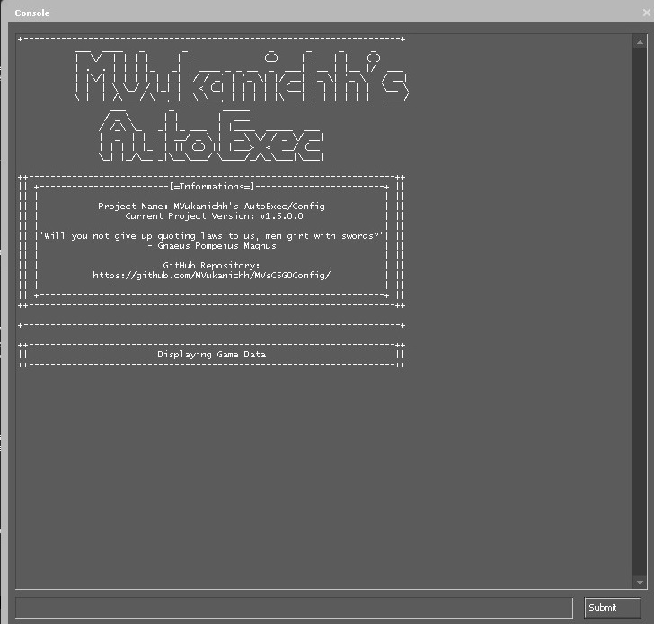

<!-- PROJECT LOGO -->
 

  

  <h1 align="center">MVukanichh's CSGO Config</h3>

  

   MVukanichh's CSGO Config Repository contains a well-documented Configs for CSGO, optimized for both performance and giving players advantage in a legitimate way.
     
        <a href="../main/CHANGELOG.md">View Changelog</a>
    ·
        <a href="../main/LICENSE.txt">View License</a>
    ·
    <a href="https://github.com/MVukanichh/MVsCSGOConfig/issues">Report Bug</a>
    ·
    <a href="https://github.com/MVukanichh/MVsCSGOConfig/issues">Request Feature</a>
  

<!-- TABLE OF CONTENTS -->

  
Table of Contents

  <ol>
    <li>
      <a href="#about-the-project">About The Project</a>
    </li>
    <li>
      <a href="#getting-started">Getting Started</a>
      <ul>
        <li><a href="#prerequisites">Prerequisites</a></li>
        <li><a href="#installation">Installation</a></li>
      </ul>
    </li>
    <li><a href="#usage">Usage</a></li>
    <li><a href="#roadmap">Roadmap</a></li>
    <li><a href="#contributing">Contributing</a></li>
    <li><a href="#license">License</a></li>
    <li><a href="#acknowledgments">Acknowledgments</a></li>
  </ol>

---

<!-- ABOUT THE PROJECT -->
## About The Project

MVukanichh's CSGO Config contains separated Configs that are called by an Autoexec file at the launch. It is done that way to sort out commands for better readability and easier future editing of the Configs, alongside for better documentation of the commands itself, as having all commands in one Config can be pretty confusing. 
 

Config is also optimized to give players legitimate advantage over opponents, as Cvars were optimized to reduce input lag, higher FPS (Although not guaranteed), better visibility, reduced client-side lag, etc... as any advantage users' have over the opponent can be crucial in winning and climbing in competitive games like CSGO.
 

Alongside Configs, and contrary to it's name, MVsCSGOConfig also contains optimized Launch Options and an optimized Language (English) file for better in-game readability of certain events in the matches, alongside editing other parts of the client itself to optimize readability of those parts too.

---

<!-- GETTING STARTED -->
## Getting Started

MVukanichh's CSGO Config is to be used as an optimized replacement Config for users' own. Even though it's a replacement Config, editing it to suit users' preferences is highly recommended. 

### Prerequisites

In order for MVsCSGOConfig to be usable, next software should be installed beforehand:

- Counter-Strike:Global offensive
- Notepad++
	- Notepad++ is used to edit Configs to match users' preferences. It is recommended to use Notepad++ instead of Windows Notepad, as it has better formatting and better readability.

### Installation

As stated above, MVsCSGOConfig does not just include Configs, but Language file and Launch Options, thus two separate installation processes must be followed.

#### Downloading the ZIP File 

In order to actually use anything in this repository, zipped file containing this repository, alongside all desired files, must be downloaded. Next steps must be reproduced in order to do so:

1. Press green "Code" button found at the top of this repository
2. Press "Download ZIP"
3. Press "Save File" and choose in which Location ZIP File should be saved to

#### Launch Options

In order to make CSGO use Launch Options, next steps must be reproduced:

1. Right click on "Counter-Strike: Global Offensive" in the Steam Library
2. Press "Properties" and a new window will pop-up
3. In the very first tab in the new window, "Set Launch Options" should be clicked on
4. Open ZIP File
5. Open Folder named "content"
4. Copy everything from "Launch Options" text file and click "Set Launch Options" button
5. Paste everything and press OK

#### Configs and Language File

In order to make CSGO initialize Configs and Custom Language File, next steps must be reproduced:

1. Right click on "Counter-strike: Global Offensive" in the Steam Library
2. Press "Properties" and a new window will pop-up
3. Click on a "Local Files" tab
4. Press "Browse Local Files"
	- Windows Explorer window will pop-up with main folder within "Counter-Strike: Global Offensive" game folder
6. Open folder named "csgo"
7. Open ZIP file 
8. Open Folder named "content"
9. Hold down Control button (CTRL) and select folders named "cfg" and "resource" within opened ZIP File and drag them to "csgo" folder
10. Press YES to everything if prompted

If done correctly, at CSGO's launch, Configs should be executed. It can be confirmed by opening console by pressing "~" key on the keyboard and checking if initialization message is present. Refer to the screenshot if unsure:

 

---

<!-- USAGE -->
## Usage

Usage of MVsCSGOConfig is really simple, as nothing has to be done except the installation process.
 
As already stated, it is highly recommended to edit Configs in order to suit users' preferences. Recommended Configs to edit are:
- /cfg/MVs/mouse.cfg
- /cfg/MVs/crosshair.cfg
- /cfg/MVs/binds.cfg

In order to edit those, by using above recommended Notepad++, next steps must be reproduced:

1. Right click on "Counter-strike: Global Offensive" in the Steam Library
2. Press "Properties" and a new window will pop-up
3. Click on a "Local Files" tab
4. Press "Browse Local Files"
5. Open folder named "csgo"
6. Open folder named "cfg"
7. Open folder named "MVs"

After this step all available Configs can be seen. After choosing Config, reproduce next steps:

1. Right click corresponding Config file
2. Hover on Open With
3. Choose Notepad++

Config can now be edited to users' preferences.

---

<!-- ROADMAP -->
## Roadmap

Following is the roadmap of MVsCSGOConfig. Many things will be added here, and/or removed in the future, so stay tuned for updates by checking the <a href="../main/CHANGELOG.md">Changelog</a>.

- [x] Update README.md to represent universal README.md template
- [x] Reorganize Repository's main branch
- [ ] Rewrite Configs for Counter-Strike 2
- [ ] Custom Language File in most popular languages
	- [ ] Russian
	- [ ] Polish
	- [ ] German

See the [open issues](https://github.com/MVukanichh/MVsCSGOConfig/issues) for a full list of proposed features (and known issues).

---

<!-- CONTRIBUTING -->
## Contributing

Contributions are what make the open source community such an amazing place to learn, inspire, and create. Any contributions made are **greatly appreciated**.

If there is any suggestion that would make this project better, open an issue with the tag "enhancement".

Don't forget to give the project a star! 

---

<!-- LICENSE -->
## License

Distributed under the cc-by-4.0 Licence. See `LICENSE.txt` for more information.

---

<!-- ACKNOWLEDGMENTS -->
## Acknowledgments

While writing this file, I've found these resources helpful and used them to make both this README.md file and other content in this project. Go check them out!

* [Choose a License for help with License](https://choosealicense.com)
* [README Templates for helping me chose README.md](https://www.readme-templates.com/)
* [Valve Software for list of CSGO Cvars](https://developer.valvesoftware.com/wiki/List_of_CS:GO_Cvars)
* [ArmynC's CSGO Config for a Config Template](https://github.com/ArmynC/ArminC-AutoExec)
* [vgalisson for Custom Text Mod](https://github.com/vgalisson/CSGO-Custom-Text-Mod)
* [BananaGaming for Custom Text Mod](https://maximhere.me/modifications/)
* [Ghostwriter for awesome Markdown editor](https://ghostwriter.kde.org/)
* [Github Docs for help with Markdown](https://docs.github.com/en/get-started/writing-on-github)

(<a href="#readme-top">back to top</a>)

---

